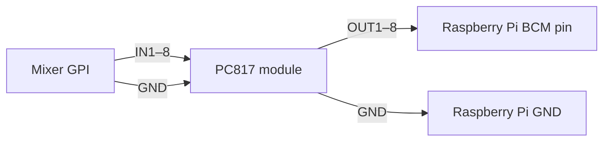
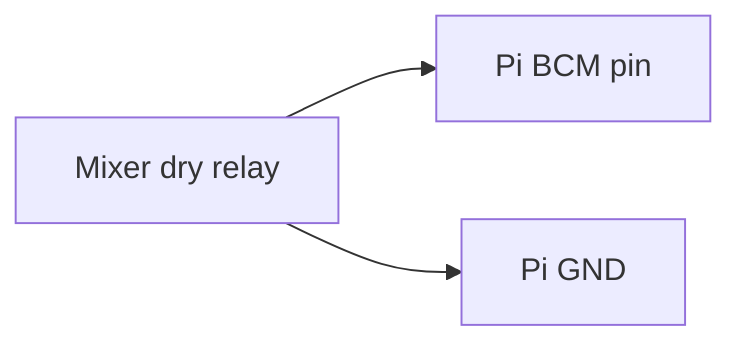

# OnAirScreen – User Manual

**Version:** 1.0.0beta11  
**Author:** Sascha Ludwig, [astrastudio.de](http://www.astrastudio.de)  
**Project:** [OnAirScreen](https://www.astrastudio.de/en/onairscreen/)  
**German version:** [BEDIENUNGSANLEITUNG.md](BEDIENUNGSANLEITUNG.md)

---

## Table of Contents

1. [Overview](#1-overview)
2. [Installation and Startup](#2-installation-and-startup)
3. [Main Screen](#3-main-screen)
4. [Keyboard Shortcuts (Hotkeys)](#4-keyboard-shortcuts-hotkeys)
5. [Settings Dialog](#5-settings-dialog)
6. [Features in Detail](#6-features-in-detail)
7. [Remote Control and API](#7-remote-control-and-api)
8. [Presets (Profiles)](#8-presets-profiles)
9. [Command-Line Options](#9-command-line-options)
10. [Configuration Storage Location](#10-configuration-storage-location)
11. [Troubleshooting](#11-troubleshooting)

---

## 1. Overview

OnAirScreen is a versatile **on-air lamp** solution for professional broadcast environments. The application combines:

- **4 status LEDs** (switchable, blinking, timed flash)
- **4 AIR timers** (microphone, phone, radio timer, stream timer); AIR3 with ▲/▼ and Top-of-Hour
- **Digital or analog clock** with optional text clock mode and lock LED (Local / NTP / PTP / LTC)
- **Stereo audio meters** (local input, Axia Livewire, or AES67 AoIP): L/R, programme LUFS, or both, optional I+LRA
- **Silence Detection** with optional on-screen WARN and API/MQTT boolean
- **Instance name** (DNS-safe, e.g. `Studio-1`) to tell several OnAirScreens apart
- **Text lines** NOW, NEXT, and WARN (with priority system)
- **Weather widget** (OpenWeatherMap)
- **Remote control** via keyboard, mouse (double-click/right-click/long-click), UDP, HTTP, Web UI, MQTT, OSC, REST API, and Bitfocus Companion
- **Home Assistant integration** via MQTT Autodiscovery
- **GPIO inputs** on Raspberry Pi (mixer GPI via optocoupler → LEDs and AIR timers)

The application starts in **fullscreen mode** by default with the mouse cursor hidden, making it suitable for dedicated studio monitors, Raspberry Pi setups, and touch-free operation.

OnAirScreen automatically adapts to different monitor aspect ratios and works on both **4:3** and **16:9/16:10** displays.

---

## 2. Installation and Startup

Ready-to-run builds for Windows, macOS, Linux, and Raspberry Pi are available from the [astrastudio shop](https://www.astrastudio.de/shop/).

OnAirScreen starts in **fullscreen** with the mouse cursor hidden. Open Settings with `Ctrl+S` (macOS: `Cmd+S`). Changes apply only after **Apply**.

### Windows

1. Download `OnAirScreen_*_Win_x64.msi` (inside `OnAirScreen_Win_x64.zip`).
2. Double-click the MSI and follow the installer. A per-machine install needs administrator rights.
3. OnAirScreen is installed to `C:\Program Files\OnAirScreen`.
4. Start it from the **Start** menu or the desktop shortcut.

The Start menu folder also contains **OAS Send** (command sender) and **OAS Send (no console)**. Settings live in the Windows Registry; logs under `%LOCALAPPDATA%\astrastudio\OnAirScreen\logs\`.

An older portable `.exe` is **not** removed by the MSI. Delete that copy yourself after installing.

Windows only syncs internet time about once a week by default, which can show the wrong clock if the time source is **Local**. Shorten the OS sync interval, or use NTP / PTP / LTC in OnAirScreen (see [5.3 Time Source](#53-time-source)).

### macOS

1. Download `OnAirScreen_*_macOS.dmg`.
2. Open the DMG and drag **OnAirScreen.app** into **Applications**. Do not run it from the DMG.
3. Start OnAirScreen from Applications, Launchpad, or Spotlight.

macOS marks downloaded apps with a quarantine flag. Because OnAirScreen is not signed with an Apple Developer ID, Gatekeeper blocks the first launch (“Apple cannot check it for malicious software” / “the developer cannot be verified”).

**Finder:** Control-click (right-click) `OnAirScreen.app` → **Open** → **Open** again. macOS remembers this for later launches.

**Terminal** (after the app is in Applications):

```bash
sudo xattr -d com.apple.quarantine /Applications/OnAirScreen.app
```

If the app still will not start: **System Settings → Privacy & Security** and use **Open Anyway**. For local audio meters, grant **Microphone** permission.

### Linux (Debian / Ubuntu / Raspberry Pi OS)

Official builds are a `.deb`. After install the app lives in `/opt/onairscreen`, starts as `onairscreen`, and appears in the application menu.


| Shop ZIP                    | Package inside                       | Architecture | For                    |
| --------------------------- | ------------------------------------ | ------------ | ---------------------- |
| `OnAirScreen_Linux_x64.zip` | `OnAirScreen_*_Linux_x64.deb`        | `amd64`      | Debian/Ubuntu PCs      |
| `OnAirScreen_PiOS_x64.zip`  | `OnAirScreen_*_RaspberryPiOSx64.deb` | `arm64`      | Raspberry Pi OS 64-bit |


Check with `dpkg --print-architecture`. The two packages are not interchangeable.

Raspberry Pi: 64-bit OS on Zero 2 W, Pi 3 / 4 / 400, CM4, Pi 5 / 500, CM5. Not supported: Pi 1 and classic Zero. You need a graphical desktop, not Lite without a GUI.

Unzip the download, then install with **apt** (not `dpkg -i` alone) so PortAudio, OpenGL, and Xcb are pulled in. The `./` in front of the file is required:

```bash
unzip OnAirScreen_Linux_x64.zip
cd ~/Downloads
sudo apt update
sudo apt install ./OnAirScreen_*.deb
```

Start from the application menu or run `onairscreen`. Updates: install the new `.deb` the same way; settings are kept. Uninstall with `sudo apt remove onairscreen` (config in `~/.config` stays).

If you used `dpkg -i` and dependencies are missing: `sudo apt -f install`.

Packages are OpenPGP-signed. Optional verification: [Package signing (GPG)](https://www.astrastudio.de/wiki/gpg-en).

### Fedora

The Fedora RPM is built on Fedora 44 (Fedora 44+). Older RHEL, Rocky, or Alma may fail because of glibc.

```bash
sudo rpm --import https://www.astrastudio.de/GPG-KEY-astrastudio
sudo dnf install ./OnAirScreen_*_Fedora_x64.rpm
```

`dnf` pulls in PortAudio and other system libraries. Check the signature with `rpm -K OnAirScreen_*_Fedora_x64.rpm` (expected: `digests signatures OK`).

### Raspberry Pi SD-card image

The [SD-card image](https://www.astrastudio.de/en/shop/onairscreen-raspberry-pi-sd-card-image/) is a ready-to-boot 64-bit Raspberry Pi OS with OnAirScreen already installed (desktop autologin, GPIO included). Unzip the download; inside is `OnAirScreen_*_RaspberryPiOS_Image.img`.

Use [Raspberry Pi Imager](https://www.raspberrypi.com/software/):

- [macOS](https://downloads.raspberrypi.org/imager/imager_latest.dmg)
- [Windows](https://downloads.raspberrypi.org/imager/imager_latest.exe)
- [Ubuntu x86](https://downloads.raspberrypi.org/imager/imager_latest_amd64.deb)

1. Insert a microSD card.
2. Start Raspberry Pi Imager.
3. **Choose OS** → **Use custom** → select the OnAirScreen `.img` file (not the `.zip`).
4. **Choose storage** (or **Choose SD Card**) and select the card.
5. **Write**.

Default user: `pi` / password `OnAirScreen1!`. Hostname: `onairscreen`. Change the password after first boot. SSH is enabled.

On the desktop: **OnAirScreen**, **OAS Pi Settings** (optional autostart), on-screen keyboard, network icon. First boot grows the root filesystem to fill the card.

If you already run Raspberry Pi OS 64-bit with a desktop, install the Pi `.deb` instead (see Linux above).

### First Startup

On first launch, default settings are loaded. Open the settings dialog with `Ctrl+S` (macOS: `Cmd+S`). Changes are only applied and saved after clicking **Apply**.

---

## 3. Main Screen

The main screen is divided into the following areas:


### Areas in Detail


| Area                | Widget                    | Function                                                 |
| ------------------- | ------------------------- | -------------------------------------------------------- |
| **Station Name**    | `labelStation`            | Station name, color configurable                         |
| **Slogan**          | `labelSlogan`             | Station tagline / claim                                  |
| **Status LEDs 1–4** | `buttonLED1`–`buttonLED4` | Large colored status indicators (ON AIR, PHONE, …)       |
| **Audio meters**    | `audioMeterWidget`        | L/R and/or programme LUFS on the left edge (optional)    |
| **Clock**           | `clockWidget`             | Digital or analog, with logo and optional weather widget |
| **Lock LED**        | Clock lock                | Bottom right: `PTP/NTP/LTC LOCK` or `LOCAL`              |
| **AIR Timers 1–4**  | `AirLED_1`–`AirLED_4`     | Stopwatch timers with icon, label, MM:SS; AIR3 with ▲/▼  |
| **Date**            | `labelTextLeft`           | Bottom left: weekday and date                            |
| **NOW**             | `labelCurrentSong`        | First footer line (e.g. current song title)              |
| **NEXT**            | `labelNews`               | Second footer line (e.g. next title)                     |
| **WARN**            | `labelWarning`            | Warning message; hides NOW/NEXT when active              |
| **Text clock**      | `labelTextRight`          | Bottom right: time in words (wordclock)                  |


> **Note:** Status LEDs and AIR timers can be toggled by **left-click**, **keyboard**, or **remote control**. Double-clicking a LED/timer does not toggle fullscreen.

### Fullscreen Mode

- Default: fullscreen with hidden mouse cursor
- Toggle: `F` or `Ctrl+F` (macOS: `Cmd+F`), **double-click** an empty area of the main screen, or right-click / long-click → **Toggle Fullscreen**
- **Right-click / long-click menu:** Toggle Fullscreen, Settings, Quit OnAirScreen; when meters are enabled also **Start I+LRA**, **Stop I+LRA**, and **Reset I+LRA**
- Fullscreen state is saved in settings (`General/fullscreen`)
- In windowed mode, position and size are saved (`Window/geometry`) and restored on the next start

---

## 4. Keyboard Shortcuts (Hotkeys)

> On **macOS**, `Ctrl` is replaced by `Cmd (⌘)`.

### Application


| Key(s)                            | Function                                        |
| --------------------------------- | ----------------------------------------------- |
| `F` / `Ctrl+F`                    | Toggle fullscreen                               |
| `Ctrl+S` / `Ctrl+,`               | Open settings dialog                            |
| `Q` / `Ctrl+Q` / `Ctrl+C` / `ESC` | Quit OnAirScreen                                |
| `I`                               | Display IP addresses in NOW/NEXT for 10 seconds |


While quitting, the main screen shows WARN `QUITTING ONAIRSCREEN` until the window closes.

### Status LEDs


| Key | Function     |
| --- | ------------ |
| `1` | LED 1 on/off |
| `2` | LED 2 on/off |
| `3` | LED 3 on/off |
| `4` | LED 4 on/off |


Left-click on a status LED toggles it as well.

### AIR Timers


| Key(s)              | Function                     | Timer               |
| ------------------- | ---------------------------- | ------------------- |
| `M` / `/`           | Start/stop                   | AIR1 (Microphone)   |
| `P` / `*`           | Start/stop                   | AIR2 (Phone)        |
| `Space` / `,` / `.` | Start/stop                   | AIR3 (Radio Timer)  |
| `S`                 | Start/stop                   | AIR4 (Stream Timer) |
| `0` / `R`           | Reset to 0:00                | AIR3 (Radio Timer)  |
| `Alt+S`             | Reset to 0:00                | AIR4 (Stream Timer) |
| `T`                 | Top-of-Hour countdown on/off | AIR3                |
| `Enter` / `Return`  | Open timer input dialog      | AIR3                |


Left-click on an AIR timer starts or stops it (same as `M` / `P` / Space / `S`). Reset, TOTH, and the timer dialog stay keyboard or remote.

### OAS USB Keyboard (Special Mapping)


| Key            | Function                         |
| -------------- | -------------------------------- |
| Display key    | Toggle fullscreen                |
| Calculator key | Shut down host (`shutdown_host`) |


---

## 5. Settings Dialog

The settings dialog opens with `Ctrl+S` or `Ctrl+,` (or right-click / long-click → **Settings**). If it is already open, the existing window is brought to the front without reloading values. Running AIR timers (including TOTH) stay intact. It contains **several tabs** (arranged vertically on the left):


| Tab              | Content                                                         |
| ---------------- | --------------------------------------------------------------- |
| **General**      | Instance name, station, LEDs, clock, logo, updates              |
| **Network**      | UDP, HTTP, multicast, MQTT, OSC                                 |
| **Time Source**  | Local / NTP / PTPv2 / LTC clock, NTP check                      |
| **Advanced**     | Formatting, weather                                             |
| **Timers**       | AIR timers 1–4                                                  |
| **Fonts**        | Fonts for all elements                                          |
| **Audio Meters** | Level meters, source, TooLoud, Silence Detection                |
| **GPIO**         | Raspberry Pi GPIO inputs for mixer GPI                          |
| **About**        | Version, license info, log level, log folder, reset             |
| **License**      | OASL 1.0 plus third-party notices (PySide6/Qt, fonts, examples) |


### Buttons (bottom bar)


| Button               | Function                                          |
| -------------------- | ------------------------------------------------- |
| **Quit**             | Quit OnAirScreen                                  |
| **Delete Preset...** | Delete a saved preset                             |
| **Load Preset...**   | Load a preset                                     |
| **Save Preset...**   | Save current configuration as a preset            |
| **Close**            | Close dialog **without** saving (discard changes) |
| **Apply**            | Apply all settings, save, and close dialog        |


---

### 5.1 General

#### Instance Name


| Setting       | Key                    | Default    | Description                                                                                                      |
| ------------- | ---------------------- | ---------- | ---------------------------------------------------------------------------------------------------------------- |
| Instance Name | `General/instancename` | `Studio-1` | DNS-safe label (1–32 characters, letters/digits/hyphen, no leading or trailing `-`) identifying this OnAirScreen |


The instance name appears in the Web UI (title and status), in `/api/status` (`instance`), on MQTT `{base}/instance/state`, and as a Home Assistant sensor. The HA device name becomes `OnAirScreen (Studio-1)` unless the instance name is already part of the device name. Remote: `CONF:General:instancename=TEXT`.

#### Station Name and Slogan


| Setting       | Key                    | Default                           | Description             |
| ------------- | ---------------------- | --------------------------------- | ----------------------- |
| Station Name  | `General/stationname`  | `Radio Eriwan`                    | Station name            |
| Station Color | `General/stationcolor` | `#FFAA00`                         | Station name text color |
| Slogan        | `General/slogan`       | `Your question is our motivation` | Station slogan / claim  |
| Slogan Color  | `General/slogancolor`  | `#FFAA00`                         | Slogan text color       |


A live preview (`StationNameDemo`, `SloganDemo`) shows your input immediately.

#### Status LEDs 1–4

For each LED (groups `LED1`–`LED4`):


| Setting           | Key               | Default   | Description                         |
| ----------------- | ----------------- | --------- | ----------------------------------- |
| Enabled           | `used`            | `true`    | Show LED on main screen             |
| Text              | `text`            | see below | LED label                           |
| Active BG Color   | `activebgcolor`   | `#FF0000` | Background color (active)           |
| Active Text Color | `activetextcolor` | `#FFFFFF` | Text color (active)                 |
| Autoflash         | `autoflash`       | `false`   | Continuous blinking every 500 ms    |
| 20sec flash       | `timedflash`      | `false`   | Blink for 20 seconds, then turn off |


**Default LED texts:**


| LED  | Text       |
| ---- | ---------- |
| LED1 | ON AIR     |
| LED2 | PHONE      |
| LED3 | DOORBELL   |
| LED4 | EAS ACTIVE |


**Shared inactive colors** (group `LEDS`):


| Setting             | Key                 | Default   |
| ------------------- | ------------------- | --------- |
| Inactive BG Color   | `inactivebgcolor`   | `#222222` |
| Inactive Text Color | `inactivetextcolor` | `#555555` |


#### Logo


| Setting       | Key               | Default                  | Description                   |
| ------------- | ----------------- | ------------------------ | ----------------------------- |
| Logo Path     | `Clock/logopath`  | `:/astrastudio_logo/...` | Path to logo image            |
| Logo Position | `Clock/logoUpper` | `false` (lower)          | Logo above or below the clock |


Buttons: `...` (file picker), `reset` (restore default logo).

#### OnAir Clock Mode / Colors


| Setting               | Key                          | Default          | Description                        |
| --------------------- | ---------------------------- | ---------------- | ---------------------------------- |
| Digital / Analog      | `Clock/digital`              | `true` (Digital) | Clock mode                         |
| Hours LEDs            | `Clock/digitalhourcolor`     | `#3232FF`        | Hour digit color                   |
| Seconds LEDs          | `Clock/digitalsecondcolor`   | `#FF9900`        | Seconds color                      |
| Digits LEDs           | `Clock/digitaldigitcolor`    | `#3232FF`        | All digit color                    |
| Show seconds          | `Clock/showSeconds`          | `false`          | Show seconds                       |
| Seconds Layout        | `Clock/showSecondsInOneLine` | `false`          | `separate` or `in one line`        |
| Static colon          | `Clock/staticColon`          | `false`          | Static colon (non-blinking)        |
| Use textclock         | `Clock/useTextClock`         | `true`           | Text clock (e.g. "it's 3 o'clock") |
| Replace IPs after 10s | `General/replacenow`         | `false`          | Replace text after IP display      |
| Replace with text     | `General/replacenowtext`     | *(empty)*        | Replacement text for NOW line      |


#### Update Check (compiled versions)


| Setting               | Key                         | Default   | Description                                   |
| --------------------- | --------------------------- | --------- | --------------------------------------------- |
| Check for updates     | `General/updatecheck`       | `false`   | Automatic update check on startup             |
| Update Key            | `General/updatekey`         | *(empty)* | Update key for paid versions (see note below) |
| Include Beta Versions | `General/updateincludebeta` | `false`   | Include beta versions                         |


> The update feature is intended for **precompiled (paid) versions**.
>
> To use update checking in the paid version, an **Update Key** must be entered. You can find it in the customer portal at [customer.astrastudio.de](https://customer.astrastudio.de) after placing your order. The field is masked; use the slashed-eye icon to show it.

---

### 5.2 Network

#### UDP / HTTP / Multicast


| Setting           | Key                         | Default       | Description                                                                                                                                                                            |
| ----------------- | --------------------------- | ------------- | -------------------------------------------------------------------------------------------------------------------------------------------------------------------------------------- |
| UDP Port          | `Network/udpport`           | `3310`        | Port for UDP commands                                                                                                                                                                  |
| HTTP Port         | `Network/httpport`          | `8010`        | Port for HTTP/Web UI                                                                                                                                                                   |
| Multicast Address | `Network/multicast_address` | `239.194.0.1` | Multicast address for UDP                                                                                                                                                              |
| Web Settings PIN  | `Network/websettingspin`    | *(empty)*     | Optional PIN for the Web UI settings overlay (stored hashed). Empty = no PIN. Leave the field empty to keep the current PIN; enter `-` to remove it. Remote Control stays unprotected. |


#### MQTT


| Setting             | Key                   | Default       | Description                   |
| ------------------- | --------------------- | ------------- | ----------------------------- |
| enable MQTT support | `MQTT/enablemqtt`     | `false`       | Enable MQTT integration       |
| MQTT Server         | `MQTT/mqttserver`     | `localhost`   | Broker hostname/IP            |
| MQTT Server Port    | `MQTT/mqttport`       | `1883`        | Broker port                   |
| MQTT User           | `MQTT/mqttuser`       | *(empty)*     | Username (optional)           |
| MQTT Password       | `MQTT/mqttpassword`   | *(empty)*     | Password (optional)           |
| MQTT Device Name    | `MQTT/mqttdevicename` | `OnAirScreen` | Device name in Home Assistant |


MQTT password and API keys are masked; use the slashed-eye icon to show them.

**MQTT Base Topic:** `onairscreen` + last 6 hex characters of the MAC address, e.g. `onairscreen_a1b2c3`.

#### OSC


| Setting            | Key               | Default   | Description                                              |
| ------------------ | ----------------- | --------- | -------------------------------------------------------- |
| enable OSC support | `OSC/enableosc`   | `false`   | Enable OSC remote control                                |
| OSC Listen Port    | `OSC/oscport`     | `8000`    | UDP port for incoming OSC                                |
| OSC Send Host      | `OSC/oscsendhost` | *(empty)* | Destination for status push (Companion IP); empty = none |
| OSC Send Port      | `OSC/oscsendport` | `9000`    | Destination UDP port (Companion feedback port)           |


Send Host is only needed for unsolicited status push (Companion button feedback). Queries always reply to the UDP sender.

---

### 5.3 Time Source

The display clock can follow the local system clock, an NTP server, a PTPv2 (IEEE 1588-2008) master, or SMPTE LTC (Leo Bodnar LBE-1110 USB serial **or** decoded from a local audio input). **OnAirScreen never changes the operating-system clock.** NTP and PTP steer an independent timebase (`time.monotonic()`), so a jump of the system clock does not move the studio clock. LTC may jump, freeze, and includes frames (`HH:MM:SS:FF`).

Date, text clock, and AIR3 top-of-hour follow the same wall time as the large clock when the source is Local, NTP, or PTP. With LTC they keep using the system date/time, because LTC has no calendar date.


| Setting            | Key                            | Default        | Description                                                               |
| ------------------ | ------------------------------ | -------------- | ------------------------------------------------------------------------- |
| Time Source        | `TimeSource/source`            | `local`        | `local`, `ntp`, `ptp`, or `ltc`                                           |
| Enable NTP-Check   | `NTP/ntpcheck`                 | `true`         | Warning if time diverges from the NTP server or the server is unreachable |
| NTP Server         | `NTP/ntpcheckserver`           | `pool.ntp.org` | NTP server for NTP as time source **and** for the optional NTP check      |
| PTP Interface      | `TimeSource/ptp_iface`         | *(empty)*      | IPv4 address of the PTP network interface (independent of AoIP)           |
| PTP Domain         | `TimeSource/ptp_domain`        | `0`            | IEEE 1588 domain (0–255)                                                  |
| LTC Input          | `TimeSource/ltc_input`         | `serial`       | `serial` (LBE-1110) or `audio` (local PortAudio decode)                   |
| LTC Serial Port    | `TimeSource/ltc_port`          | *(empty)*      | USB serial device of the LBE-1110; empty = Auto                           |
| LTC Audio Device   | `TimeSource/ltc_audio_device`  | *(empty)*      | Local capture device; empty = system default                              |
| LTC Channel        | `TimeSource/ltc_audio_channel` | `0`            | `0` = Left, `1` = Right                                                   |
| LTC unlock warning | `TimeSource/ltc_warn`          | `false`        | WARN text when LTC drops; the `LTC NOT LOCKED` LED always remains         |


**Local System Clock:** The display uses the OS clock. With NTP-Check enabled, the OS clock is compared to the NTP server (deviation > 0.3 s or errors → warning, priority -1).

**NTP Server:** OnAirScreen queries the NTP Server field and steers its own clock. The OS time is not used after the first successful sample. The field stays editable even when NTP-Check is off. Loss of NTP: last time keeps running and a warning is shown.

**PTPv2 IEEE 1588-2008:** Software slave on multicast `224.0.1.129` UDP 319/320 (event/general), delay mechanism E2E. Typical accuracy is milliseconds (no hardware timestamping). Choose the studio/AoIP VLAN interface independently of the Audio Meters AoIP interface. Loss of Sync: last time keeps running plus warning.

**LTC:** One time source with two inputs. Frame rate is inferred from incoming frames (24 / 25 / 30). Loss of LTC: last timecode is frozen (`LTC NOT LOCKED`). The large WARN messages (`waiting for LTC lock`, `Clock not LTC synchronized`, `LTC reader not connected`) are **off by default** so video scrubbing does not flood WARN; enable **Show LTC unlock warning** if you want them. The lock LED always shows `LTC LOCK` / `LTC NOT LOCKED`. NTP-Check still compares the OS clock to the NTP server, not the timecode.

**LBE-1110 Serial:** USB CDC virtual serial port of a [Leo Bodnar LBE-1110](https://www.leobodnar.com/shop/index.php?main_page=product_info&cPath=120&products_id=374); no drivers. Auto selects a Leo Bodnar device (USB VID `0x1DD2`) or an LBE-1110 / CDC port.

**Audio Input:** Decodes SMPTE LTC (biphase-mark) from a **local** PortAudio capture device, independent of Audio Meters (not Livewire/AES67). Choose Left or Right (default Left). On some hosts the same device cannot be opened twice — if meters already use that input, pick a different device for LTC.

The clock lock LED (bottom right) is green when the selected source is locked and red when it is not. Next to it: `PTP LOCK` / `PTP NOT LOCKED`, `NTP LOCK` / `NTP NOT LOCKED`, `LTC LOCK` / `LTC NOT LOCKED`, or `LOCAL`.

> **Recommendation:** Use a local NTP server on your studio network, as `pool.ntp.org` can be unreliable at times.

---

### 5.4 Advanced


| Setting            | Key                            | Default               | Description         |
| ------------------ | ------------------------------ | --------------------- | ------------------- |
| Date format        | `Formatting/dateFormat`        | `dddd, dd. MMMM yyyy` | Qt date format      |
| Time format        | `Formatting/isAmPm`            | `false` (24h)         | 24-hour or AM/PM    |
| Textclock Language | `Formatting/textClockLanguage` | `English`             | Text clock language |


**Available text clock languages:** English, German, Dutch, French

**Date format placeholders** (Qt notation, excerpt):


| Placeholder    | Meaning                   |
| -------------- | ------------------------- |
| `d` / `dd`     | Day (1–31 / 01–31)        |
| `ddd` / `dddd` | Weekday (short / long)    |
| `M` / `MM`     | Month (1–12 / 01–12)      |
| `MMM` / `MMMM` | Month name (short / long) |
| `yy` / `yyyy`  | Year (2 / 4 digits)       |


#### Weather Widget (OpenWeatherMap)


| Setting             | Key                              | Default            | Description                    |
| ------------------- | -------------------------------- | ------------------ | ------------------------------ |
| show Weather Widget | `WeatherWidget/owmWidgetEnabled` | `false`            | Enable weather widget          |
| API Key             | `WeatherWidget/owmAPIKey`        | *(empty)*          | OpenWeatherMap API key         |
| City ID             | `WeatherWidget/owmCityID`        | `2643743` (London) | OpenWeatherMap city ID         |
| Language            | `WeatherWidget/owmLanguage`      | `English`          | Weather description language   |
| Unit                | `WeatherWidget/owmUnit`          | `Celsius`          | Celsius, Fahrenheit, or Kelvin |


Type a city name next to **City ID**, press **Find** (or Return), and pick a match from the dropdown. The City ID is filled automatically; you can still enter an ID by hand. The API key is masked; use the slashed-eye icon to show it.

**Test API:** Button to test the API connection with current settings.

**Available weather languages:** Arabic, Bulgarian, Catalan, Czech, German, Greek, English, Persian (Farsi), Finnish, French, Galician, Croatian, Hungarian, Italian, Japanese, Korean, Latvian, Lithuanian, Macedonian, Dutch, Polish, Portuguese, Romanian, Russian, Swedish, Slovak, Slovenian, Spanish, Turkish, Ukrainian, Vietnamese, Chinese Simplified, Chinese Traditional

More information: [WeatherWidget Guide](https://www.astrastudio.de/wiki/onairscreen#weather-widget)

---

### 5.5 Timers

For each AIR timer (group `Timers`):


| Setting           | Key                     | Default      | Description               |
| ----------------- | ----------------------- | ------------ | ------------------------- |
| Enabled           | `TimerAIR{n}Enabled`    | `true`       | Show timer on main screen |
| Text              | `TimerAIR{n}Text`       | see below    | Timer label               |
| Active BG Color   | `AIR{n}activebgcolor`   | `#FF0000`    | Background color (active) |
| Active Text Color | `AIR{n}activetextcolor` | `#FFFFFF`    | Text color (active)       |
| Icon Path         | `air{n}iconpath`        | default icon | Path to timer icon        |


**Default AIR labels and icons:**


| Timer | Default Text | Default Icon    | Function                                 |
| ----- | ------------ | --------------- | ---------------------------------------- |
| AIR1  | Mic          | Microphone icon | Microphone stopwatch                     |
| AIR2  | Phone        | Phone icon      | Phone stopwatch                          |
| AIR3  | Timer        | Timer icon      | Radio timer (count up/down, Top-of-Hour) |
| AIR4  | Stream       | Antenna icon    | Stream timer                             |


| Setting         | Key                | Default      | Description                                          |
| --------------- | ------------------ | ------------ | ---------------------------------------------------- |
| TOTH Timer Text | `TimerTOTHText`    | `TOTH Timer` | AIR3 label while the top-of-hour countdown is active |
| AIR Min Width   | `TimerAIRMinWidth` | `200`        | Minimum width of AIR displays (pixels)               |


---

### 5.6 Fonts

Font family, size, and weight can be set individually for each UI element:


| Element      | Group `Fonts`                     | Default            |
| ------------ | --------------------------------- | ------------------ |
| LED1–4       | `LED{n}FontName/Size/Weight`      | Roboto, 32pt, Bold |
| AIR1–4       | `AIR{n}FontName/Size/Weight`      | Roboto, 24pt, Bold |
| Station Name | `StationNameFontName/Size/Weight` | Roboto, 24pt, Bold |
| Slogan       | `SloganFontName/Size/Weight`      | Roboto, 18pt, Bold |


The family combo lists application fonts (including bundled Roboto and Noto Sans). Size is a point spin box (8–96 pt), **Bold** toggles weight, and **Reset** restores Roboto with the default size and bold for that row. The preview shows sample text in the selected font.

Fonts from the `fonts/` directory are also loaded at startup.

---

### 5.7 About


| Element            | Description                                             |
| ------------------ | ------------------------------------------------------- |
| Version            | Current OnAirScreen version                             |
| Distribution       | `OpenSource` or commercial distribution                 |
| Settings Path      | Path to the configuration file on this system           |
| Log Folder         | Folder with `onairscreen.log` and crash reports         |
| Open log folder    | Opens that folder in the system file manager            |
| Loglevel           | `DEBUG`, `INFO`, `WARNING`, `ERROR`, `CRITICAL`, `NONE` |
| Enable Reset       | Checkbox to enable the reset button                     |
| Reset all settings | Resets **all** settings to defaults (cannot be undone)  |


---

### 5.8 Audio Meters

Stereo level meters on the left side of the screen: L/R (sample peak, true peak, or BBC PPM), a single programme LUFS bar (EBU R128), or both. L/R bars fill with RMS and overlay the current peak. Programme LUFS is one bar (momentary M, short-term S tick). Integrated I and loudness range (LRA) are off by default and start with `LUFSI:START` (Web UI, MQTT Home Assistant switch, Companion, OSC, UDP/HTTP, or right-click / long-click). `LUFSI:RESET` restarts a running session; if the session is stopped it hides I and LRA on the meter. Right-click or long-click the main screen → **Start I+LRA**, **Stop I+LRA**, or **Reset I+LRA**. Configure under **Settings → Audio Meters**.

Existing configs with `Audio/unit=lufs` (no `layout` key) are migrated to layout `lufs` and L/R unit `dbtp`.


| Setting                              | Key                            | Default    | Description                                                         |
| ------------------------------------ | ------------------------------ | ---------- | ------------------------------------------------------------------- |
| Enable Audio Meters                  | `Audio/enabled`                | `true`     | Show meter column                                                   |
| Audio Source                         | `Audio/source`                 | `device`   | `device`, `livewire`, or `aes67`                                    |
| Audio Input                          | `Audio/input_device`           | *(empty)*  | PortAudio device name (when source = Local Input)                   |
| Livewire Channel                     | `Audio/livewire_channel`       | `1`        | Livewire channel 1–32767 (also via Livewire Source combo)           |
| AoIP Interface                       | `Audio/livewire_iface`         | *(empty)*  | IPv4 for Livewire/AES67 IGMP join; empty = default                  |
| AES67 Stream ID                      | `Audio/aes67_id`               | *(empty)*  | SDP origin hash of the selected stream                              |
| AES67 Address                        | `Audio/aes67_addr`             | *(empty)*  | Multicast address used for RTP capture                              |
| AES67 Port                           | `Audio/aes67_port`             | `5004`     | RTP UDP port                                                        |
| AES67 Name                           | `Audio/aes67_name`             | *(empty)*  | Display name from SDP `s=`                                          |
| AES67 Codec                          | `Audio/aes67_codec`            | `L24`      | `L16` or `L24`                                                      |
| AES67 Sample Rate                    | `Audio/aes67_rate`             | `48000`    | `44100`, `48000`, or `96000`                                        |
| AES67 Channels                       | `Audio/aes67_channels`         | `2`        | Stream channel count (meter uses first two)                         |
| AES67 Pasted SDP                     | `Audio/aes67_manual`           | `false`    | `true` if the stream was added via Paste SDP                        |
| Meter Layout                         | `Audio/layout`                 | `both`     | `lr`, `lufs`, or `both`                                             |
| Display Unit                         | `Audio/unit`                   | `dbtp`     | L/R unit: `dbfs`, `dbtp`, `bbc_ppm` (PPM only in `lr`)              |
| Display Style                        | `Audio/display_style`          | `bargraph` | `solid` or `bargraph`                                               |
| Meter Width                          | `Audio/meter_width`            | `115`      | Overall width in pixels (53–201); extra width thickens visible bars |
| LUFS Reference Preset                | `Audio/lufs_reference_preset`  | `ebu_r128` | `ebu_r128`, `atsc_a85`, `aes_16`, `aes_18`, `custom`                |
| LUFS Reference                       | `Audio/lufs_reference`         | `-23.0`    | Target level in LUFS (peg on the scale)                             |
| Peak Hold                            | `Audio/peak_hold`              | `true`     | Hold peak marker                                                    |
| Peak Hold Seconds                    | `Audio/peak_hold_seconds`      | `1.5`      | Peak hold duration                                                  |
| TooLoud                              | `Audio/tooloud`                | `true`     | Action when true peak exceeds threshold                             |
| TooLoud Text                         | `Audio/tooloudtext`            | `TOO LOUD` | Warning text                                                        |
| TooLoud Threshold                    | `Audio/tooloud_threshold_dbtp` | `-1.0`     | Threshold in dBTP                                                   |
| TooLoud Action                       | `Audio/tooloud_action`         | `warning`  | `warning` or `led`                                                  |
| TooLoud LED                          | `Audio/tooloud_led`            | `1`        | LED 1–4 when action = LED                                           |
| Enable Silence Detection             | `Audio/silence`                | `false`    | Watch the current audio source for silence                          |
| Show WARN in OAS                     | `Audio/silence_warn`           | `true`     | Show the silence alarm as an on-screen WARN                         |
| Trigger when Device/Stream is absent | `Audio/silence_on_absent`      | `true`     | Count missing capture (no device / no stream) as silence            |
| Silence Message                      | `Audio/silence_text`           | `SILENCE`  | WARN text (only used when Show WARN is on)                          |
| Silence Threshold                    | `Audio/silence_threshold_dbfs` | `-50.0`    | Sample-peak threshold in dBFS (−90…0)                               |
| Max. Silence duration                | `Audio/silence_duration_s`     | `10.0`     | Seconds below threshold before the alarm latches                    |
| Recovery time                        | `Audio/silence_recovery_s`     | `2.0`      | Seconds above threshold before the alarm clears                     |
| HTTP GET URL                         | `Audio/silence_http_url`       | *(empty)*  | Optional URL called once when silence becomes true                  |


Silence Detection uses the **same audio source** as the meters (Local Input, Livewire, or AES67). The threshold is always **sample-peak dBFS**, independent of the meter display unit. Capture keeps running when Silence Detection is on, even if the meters are hidden.

The alarm latches after the level stays below the threshold for the configured duration, and clears after the signal stays above the threshold for the recovery time. **Show WARN in OAS** is independent of the API/MQTT boolean: the boolean is always updated while detection is enabled. An optional HTTP GET is fired only on the rising edge (`false` → `true`).

**Device/Stream absent:** when this option is on (default), a source that never starts (no device, AES67 with **None**, capture start failed) is treated like silence after the same duration. When the option is off, only real level callbacks count; stopping capture clears a stuck alarm. Packet loss on a **running** stream (RTP timeout / silence injection) is always treated as silence.

The on-screen WARN uses priority **2** (high), so it is shown above TooLoud (priority 1). The `silence` API/MQTT flag is independent of `texts.warn` and of `warning/active`.

**Livewire:** The PC must be on the AoIP/Livewire VLAN (IGMP/multicast). While Settings (desktop dialog or Web UI overlay) are open, advertised sources appear in the **Livewire Source** combo (`239.192.255.3` UDP **4001**, standard stereo streams only). Pick a source or type a channel. Channel *N* maps to multicast `239.192.0.0 + N` on UDP port **5004** (48 kHz / 24‑bit stereo RTP). After Apply, capture continues from the stored channel if advertisements stop.

**AES67:** SAP discovery uses multicast `239.255.255.255` and RFC 2974 `224.2.127.254` UDP **9875** while the settings dialog or Web UI overlay is open. The stream list updates live **only when streams appear or disappear** (no flicker while the set is unchanged). The combo always has **None** (no stream). SAP entries disappear after they stop announcing (deletion or timeout). Use **Paste SDP** if a device does not announce via SAP — those entries stay in the list and are labeled **pasted SDP**. Supported: L16/L24 at 44.1/48/96 kHz, 1–64 channels (meters show channels 1–2). Dante AES67 SAP streams are listed like others (`a=keywords:Dante` is label-only). No PTP and no playout — metering only. After Apply, capture continues from the stored address/port even if SAP is silent. Apply with **None** stops AES67 capture and clears the meter.

**Local input:** on macOS grant microphone permission to OnAirScreen.

---

### 5.9 GPIO

Raspberry Pi GPIO inputs map mixer GPI contacts to the same LED and AIR commands as the network API. Configure under **Settings → GPIO**. Available on Raspberry Pi only.

Pi GPIO is **3.3 V**. Mixer GPI is often 5–24 V or open collector — **always use a PC817 isolation module**. Dry relay contacts to GND may be wired directly (internal pull-up, Invert on).


| Setting        | Key                 | Default                      | Description                             |
| -------------- | ------------------- | ---------------------------- | --------------------------------------- |
| Enable GPIO    | `GPIO/enabled`      | `false`                      | Watch configured BCM pins               |
| Debounce       | `GPIO/debounce_ms`  | `50`                         | Ignore bounce shorter than this (ms)    |
| GPI*n* Enable  | `GPIO/gpiN_enabled` | GPI1–2 on, 3–8 off           | Use this input                          |
| GPI*n* BCM pin | `GPIO/gpiN_pin`     | 17, 27, 5, 6, 12, 13, 16, 22 | Safe BCM pins only                      |
| GPI*n* Invert  | `GPIO/gpiN_invert`  | `true`                       | On: contact to GND is active (pull-up)  |
| GPI*n* Mode    | `GPIO/gpiN_mode`    | `level`                      | `level`, `rising`, `falling`, `both`    |
| GPI*n* Action  | `GPIO/gpiN_action`  | LED1 / AIR3                  | LED1–4, AIR1–4, AIR3/AIR4 Reset, Custom |
| GPI*n* Command | `GPIO/gpiN_command` | *(empty)*                    | API command for Custom action           |


**Level** (typical tally / fader): closed sends `LED1:ON` / `AIR3:ON`, open sends `OFF`. **Rising / Falling / Both** send `TOGGLE` (or Reset / the custom command) on that edge.

Factory mapping for a two-wire mixer GPI: GPI1 BCM 17 → LED1 (ON AIR), GPI2 BCM 27 → AIR3 (radio timer). Enable GPIO and connect the contacts through a PC817 module (or dry relays to GND).

Safe BCM pins: `5, 6, 12, 13, 16, 17, 22, 23, 24, 25, 26, 27` (not I2C 2/3 or UART 14/15).

#### Wiring

The 40-pin GPIO header is the same on Raspberry Pi **3, 4, 400, 5, 500, Zero 2 W**, and the **CM4/CM5** IO-board header. Settings use **BCM** numbers, not physical pin numbers.

**PC817 module (recommended for mixer GPI 5–24 V or open collector):**




Each mixer GPI is two wires: that channel’s `IN1`–`IN8` and the input-side `GND`. On the Pi side the matching `OUT1`–`OUT8` goes to the BCM pin and the output-side `GND` to Pi GND (GPI1 → IN1/OUT1, GPI2 → IN2/OUT2, …). Leave **Invert** on (active = pin pulled to GND). Example: [Hailege 8-channel PC817 isolation module](https://amzn.to/4xbrnd8) (Amazon affiliate link).

**Dry relay contact only** (already isolated, no voltage on the mixer GPI):




Do not feed 5 V or 12/24 V into a GPIO pin.

**Factory defaults on the header** (board oriented with the USB/Ethernet ports down, pin 1 is the corner 3.3 V next to the SD card / power end on most boards):


| OAS input | BCM | Header pin                   | Typical use        |
| --------- | --- | ---------------------------- | ------------------ |
| GPI1      | 17  | 11                           | ON AIR (LED1)      |
| GPI2      | 27  | 13                           | Radio timer (AIR3) |
| Ground    | —   | 6, 9, 14, 20, 25, 30, 34, 39 | Common GND         |


Safe BCM pins and their header pins (use these in **BCM pin**):


| BCM | Header | BCM | Header | BCM | Header |
| --- | ------ | --- | ------ | --- | ------ |
| 5   | 29     | 12  | 32     | 22  | 15     |
| 6   | 31     | 13  | 33     | 23  | 16     |
| 16  | 36     | 17  | 11     | 24  | 18     |
| 26  | 37     | 27  | 13     | 25  | 22     |


**Pinout references** (40-pin header, BCM numbering):

- [Raspberry Pi GPIO and 40-pin header](https://www.raspberrypi.com/documentation/computers/raspberry-pi.html#gpio-and-the-40-pin-header) (official)
- [pinout.xyz](https://pinout.xyz/) (interactive; same header on Pi 3 / 4 / 5 / Zero 2 W)
- Pi 5 overview: [Raspberry Pi 5](https://www.raspberrypi.com/documentation/computers/raspberry-pi-5.html)
- Compute Module IO boards: [Compute Module](https://www.raspberrypi.com/documentation/computers/compute-module.html)

---

## 6. Features in Detail

### 6.1 Status LEDs

Each LED can be switched on and off individually (keys `1`–`4`, left-click, or remote control). In the active state, configured foreground and background colors are used; in the inactive state, the shared inactive colors apply.

**Blink modes:**

- **Autoflash:** Blinks continuously at 500 ms intervals while the LED is on
- **20sec flash:** Blinks for 20 seconds, then turns off automatically

### 6.2 AIR Timers

All AIR timers display elapsed time in **M:SS** format (e.g. `3:45`). AIR3 shows **▲** (count-up) or **▼** (count-down) under the timer icon.

#### AIR1 (Microphone) and AIR2 (Phone)

- Simple stopwatch: start/stop, seconds reset to 0 on start
- Control: `M`/`/` (AIR1), `P`/`*` (AIR2), or left-click the timer

#### AIR3 (Radio Timer)

The most versatile timer with three operating modes:

1. **Count-Up:** Default mode, counts from 0:00 upward
2. **Count-Down:** Set via `AIR3TIME:seconds` or timer dialog
3. **Top-of-Hour (TOH):** Countdown to the next full hour (format MM:SS, e.g. `22:38`)

Start/stop: Space, `,` / `.`, or left-click the timer.

**Top-of-Hour behavior:**

- First call: Calculates remaining time until `:00`, starts countdown, label shows the configured TOTH Timer text (default `TOTH Timer`)
- Second call (or `OFF`/`TOGGLE` while active): Stops and restores the configured AIR3 label
- Synchronized with the display clock, stops automatically at hour change and restores the configured label
- API status: `"topOfHour": true` and `"text"` set to the configured TOTH Timer text in `air[3]` when active

**Timer input dialog** (`Enter`):


| Input            | Meaning                           |
| ---------------- | --------------------------------- |
| `2,10` or `2.10` | 2 minutes 10 seconds (count-down) |
| `30`             | 30 seconds (count-down)           |
| `0`              | Count-up mode                     |


#### AIR4 (Stream Timer)

- Like AIR3, but without Top-of-Hour function
- Control: `S` or left-click (start/stop), `Alt+S` (reset)

### 6.3 Text Lines NOW, NEXT, WARN


| Line | API Command | Description                                        |
| ---- | ----------- | -------------------------------------------------- |
| NOW  | `NOW:TEXT`  | First footer line (current title, IP addresses, …) |
| NEXT | `NEXT:TEXT` | Second footer line (next title, …)                 |
| WARN | `WARN:TEXT` | Warning message with red warning mode              |


**Maximum text length:** 500 characters (input is automatically sanitized and truncated).

#### Warning System with Priorities


| Priority | Meaning                 | API Format    |
| -------- | ----------------------- | ------------- |
| -1       | NTP warning (automatic) | *(internal)*  |
| 0        | Normal / Legacy         | `WARN:TEXT`   |
| 1        | Medium                  | `WARN:1:TEXT` |
| 2        | High (highest)          | `WARN:2:TEXT` |


**Display rule:** The warning with the **highest priority** is shown. NTP warnings (-1) only appear when no other warning is active. When a warning is active, NOW and NEXT are hidden.

**Clearing warnings:**


| Method     | Command                              |
| ---------- | ------------------------------------ |
| Priority 0 | `WARN:` *(empty text)*               |
| Priority 1 | `WARN:1:` *(empty text after colon)* |
| Priority 2 | `WARN:2:` *(empty text after colon)* |
| Web UI     | X button next to the warning         |


### 6.4 Displaying IP Addresses

Press `I` (or automatically at startup) to show all local IPv4 addresses in **NOW** and IPv6 addresses in **NEXT** for 10 seconds.

If **Replace IPs after 10s** is enabled, the NOW line is replaced with the configured replacement text (`replacenowtext`) afterwards.

### 6.5 Clock

- **Digital:** LED-style digit display with configurable colors
- **Analog:** Classic clock face
- **Text clock:** Spoken time display (e.g. "it's a quarter past three")
- **Time source:** Local, NTP, PTPv2, or LTC — see [5.3 Time Source](#53-time-source); the OS clock is never set
- **Lock LED** bottom right: green = locked, red = not locked (`PTP LOCK` / `NTP LOCK` / `LTC LOCK`, or `LOCAL`)
- **Weather widget:** Optionally displayed next to the clock (OpenWeatherMap)

### 6.6 System Commands (API only)


| Command        | Function                   |
| -------------- | -------------------------- |
| `CMD:REBOOT`   | Restart operating system   |
| `CMD:SHUTDOWN` | Shut down operating system |
| `CMD:QUIT`     | Quit OnAirScreen           |


> These commands are **not** available through the settings UI, only via API/MQTT.

### 6.7 GPIO Inputs (Raspberry Pi)

Mixer GPI (contact closure) can drive LEDs and AIR timers through Raspberry Pi GPIO. See [5.9 GPIO](#59-gpio) for the wiring diagram, PC817 module, header pins, and pinout links. GPIO is local hardware, not a network API.

---

## 7. Remote Control and API

OnAirScreen supports remote control via UDP, HTTP, Web UI, MQTT, OSC, REST API, and Bitfocus Companion.

### 7.1 UDP (Port 3310)

```bash
# Turn on LED1
echo "LED1:ON" > /dev/udp/127.0.0.1/3310

# Set NOW text
echo "NOW:Current Song Title" > /dev/udp/127.0.0.1/3310

# Change configuration
echo "CONF:LED1:text=STUDIO LIVE" > /dev/udp/127.0.0.1/3310
echo "CONF:CONF:APPLY=TRUE" > /dev/udp/127.0.0.1/3310
```

### 7.2 HTTP (Port 8010)

```bash
curl "http://127.0.0.1:8010/?cmd=LED1:ON"
curl "http://127.0.0.1:8010/?cmd=NOW:Current%20Song"
```

### 7.3 Web UI

Open in browser: `http://<IP-address>:8010/`

**Web UI features:**

- Real-time status for LEDs, AIR timers, text fields, silence alarm, and loudness I+LRA (I and LRA values plus running state)
- Instance name in the title and status (from `/api/status` `instance`)
- WebSocket updates (with HTTP polling fallback; WebSocket is retried after polling)
- Dark mode with persistent theme setting
- LED and timer controls with toggle buttons
- Start / Stop / Reset for programme I + LRA (`LUFSI`)
- Top-of-Hour button for AIR3
- AIR3 time input (`m:ss`, `m,ss`, or seconds)
- AIR3 count-up vs. countdown in the status tile
- Keys `1`–`4` toggle LEDs (ignored while typing)
- Text input for NOW, NEXT, WARN (NOW/NEXT follow live status unless you are editing)
- Warnings with priority and delete button
- Version and distribution information
- Persistent connection badge (Live / Polling / Offline) plus error modal
- Settings gear (top right): tabbed overlay for all editable settings, optional PIN, Apply, and preset load/save
- Audio Meters in the overlay: Livewire Source and AES67 Stream dropdowns (live discovery while the overlay is open) plus Paste SDP

### 7.4 REST API

**Query status:**

```bash
curl http://127.0.0.1:8010/api/status
```

Response (simplified):

```json
{
  "leds": { "1": { "status": true, "text": "ON AIR", "autoflash": false } },
  "air": { "3": { "status": false, "seconds": 0, "text": "Timer", "topOfHour": false, "countDown": false } },
  "texts": { "now": "Song", "next": "Next Song", "warn": "" },
  "warnings": [],
  "silence": false,
  "lufsIntegrated": false,
  "lufsI": null,
  "lra": null,
  "instance": "Studio-1",
  "version": "1.0.0beta11",
  "distribution": "OpenSource"
}
```

The `silence` field is `true` while Silence Detection has latched, even if the on-screen WARN is disabled. `lufsIntegrated` is `true` while a gated I + LRA session is running (`LUFSI:START`). `lufsI` is gated integrated loudness in LUFS (one decimal) and `lra` is loudness range in LU; both are `null` until enough audio has been measured. `instance` is the configured instance name. For AIR3, `topOfHour` indicates whether the Top-of-Hour countdown is active, and `countDown` is `true` while the radio timer is counting down.

**Send command:**

```bash
curl "http://127.0.0.1:8010/api/command?cmd=LED1:ON"
```

**Web settings** (optional PIN via `X-Settings-Token` after `POST /api/settings/auth`):

```bash
curl http://127.0.0.1:8010/api/settings/auth
curl -X POST http://127.0.0.1:8010/api/settings/auth -H 'Content-Type: application/json' -d '{"pin":"1234"}'
curl http://127.0.0.1:8010/api/settings
curl "http://127.0.0.1:8010/api/settings/aoip?source=livewire&channel=1"
curl -X PUT http://127.0.0.1:8010/api/settings -H 'Content-Type: application/json' -d '{"config":{"General":{"slogan":"On air"}}}'
```

Secrets (`updatekey`, MQTT password, OpenWeatherMap API key) are returned in plaintext so the settings overlay can show them. The PIN is returned as `__unchanged__` (only a hash is stored). Send that sentinel to keep the PIN, or `-` to clear it. UDP/HTTP port changes are stored immediately but need an application restart.

### 7.5 MQTT

**Send commands** (topic: `{base_topic}/...`):


| Topic                   | Payload                           | Function               |
| ----------------------- | --------------------------------- | ---------------------- |
| `led{1-4}/set`          | `ON` / `OFF` / `TOGGLE`           | Switch LED             |
| `air{1-4}/set`          | `ON` / `OFF` / `TOGGLE`           | Start/stop timer       |
| `air{3-4}/reset`        | `PRESS`                           | Reset timer            |
| `air3/toh`              | `ON` / `OFF` / `TOGGLE`           | Top-of-Hour            |
| `lufs/integrated/set`   | `ON` / `OFF` / `TOGGLE` / `RESET` | Start/stop/reset I+LRA |
| `lufs/integrated/reset` | `PRESS`                           | Reset I+LRA            |
| `text/now/set`          | `TEXT`                            | Set NOW text           |
| `text/next/set`         | `TEXT`                            | Set NEXT text          |
| `text/warn/set`         | `TEXT`                            | Set WARN text          |


**Status topics** (published automatically):


| Topic                        | Payload                     |
| ---------------------------- | --------------------------- |
| `led{1-4}/state`             | `ON` / `OFF`                |
| `air{1-4}/state`             | `ON` / `OFF`                |
| `air{1-4}/time`              | Seconds (integer)           |
| `air3/toh/state`             | `true` / `false`            |
| `text/{now,next,warn}/state` | Text                        |
| `warning/active`             | `true` / `false`            |
| `silence/active`             | `true` / `false`            |
| `lufs/integrated/state`      | `ON` / `OFF`                |
| `lufs/i`                     | I in LUFS (`""` if unknown) |
| `lufs/lra`                   | LRA in LU (`""` if unknown) |
| `instance/state`             | Instance name               |


**Home Assistant Autodiscovery** automatically creates:

- LED switches (LED1–4)
- AIR timer switches (AIR1–4)
- AIR time sensors (AIR1–4 Time)
- Reset buttons (AIR3/AIR4)
- Top-of-Hour button (AIR3)
- Text entities (NOW, NEXT, WARN)
- Binary sensors: Warning Active, Silence
- Sensor: Instance (instance name)
- Loudness I+LRA switch (start resets; stop freezes last values)
- Loudness I+LRA Reset button (restart if running; hide I and LRA if stopped)
- Sensors: Loudness I (LUFS), Loudness LRA (LU)

The Home Assistant device name becomes `OnAirScreen (Studio-1)` unless the instance name is already part of the MQTT Device Name.

### 7.6 Bitfocus Companion (recommended)

The dedicated **astrastudio-OnAirScreen** Companion module is the recommended way to drive Stream Decks and similar surfaces. Commands use HTTP (port **8010**): `GET /api/command?cmd=LED1:ON`. Live status prefers the OnAirScreen **WebSocket** on HTTP port **+ 1** (so **8011** when HTTP is 8010) and falls back to polling `GET /api/status` (default every 500 ms). **OSC is not required.** Button AIR times stay close to the studio display (MIC = AIR1). Allow both ports through the firewall.

**OnAirScreen:** HTTP must be reachable (default). You can leave OSC off.

**Companion** (local module until it is in the Companion Store):

1. In the `OAS-Companion` repo: `yarn install && yarn build`
2. Symlink that folder into Companion's `module-local-dev` directory as `companion-module-astrastudio-onairscreen` (or add the path under Companion **Developer** settings)
3. Restart Companion and add connection **astrastudio / OnAirScreen**
4. Host = OnAirScreen IP, HTTP port `8010` (must match **Settings → Network**). Leave WebSocket enabled unless you must poll only.

Drag presets for LED1–4 (toggle + colour), AIR1–4 with live caption and time on the button (MIC = AIR1), TOTH, Reset AIR3/4, NOW / NEXT / WARN, Silence, Loudness I+LRA, and Reset I+LRA.

Variables such as `$(oas:air1_time)`, `$(oas:lufs_i)`, and `$(oas:lra)` and feedbacks (LED on, AIR running, TOTH, Silence, WARN, Loudness I+LRA) update from WebSocket or the status poll. Set the connection Label to `oas` so those examples match. The connection status shows instance name and version, for example `Studio-1 · 1.0.0beta11`. The module `HELP.md` lists every action, feedback, and variable.

If you cannot load a custom module, **Generic OSC** remains available (next section). Status push over OSC is slower (every 5 seconds) than the HTTP poll / WebSocket.

### 7.7 OSC (Port 8000)

Enable OSC under **Settings → Network**. Prefix is `/oas`. Integers `1`/`0` mean ON/OFF; no argument means TOGGLE. Text uses a string argument.

**Set (commands):**


| Address                      | Argument                    | Function           |
| ---------------------------- | --------------------------- | ------------------ |
| `/oas/led{1-4}`              | `i` 0/1, or none for toggle | LED                |
| `/oas/air{1-4}`              | `i` 0/1, or none for toggle | AIR timer          |
| `/oas/air{3-4}/reset`        | none                        | Reset AIR3/AIR4    |
| `/oas/air3/toh`              | `i` 0/1                     | Top-of-Hour        |
| `/oas/air3/time`             | `i` seconds (omit to query) | Set AIR3 time      |
| `/oas/text/now`              | `s` text                    | NOW                |
| `/oas/text/next`             | `s` text                    | NEXT               |
| `/oas/text/warn`             | `s` text                    | WARN               |
| `/oas/command`               | `s` `COMMAND:VALUE`         | Raw API command    |
| `/oas/lufs/integrated`       | `i` 0/1, or none for toggle | Start/stop I + LRA |
| `/oas/lufs/integrated/reset` | none                        | Reset I + LRA      |


**Query (reply to the UDP sender, no Send Host needed):** send the `/state` address (or `/oas/status` for everything). Replies use integer `0/1` for booleans and strings for text. `/oas/lufs/integrated/state` reports whether I + LRA is running. `/oas/lufs/i` and `/oas/lufs/lra` report the current I (LUFS) and LRA (LU) as one-decimal strings, or empty when unknown.

**Push (Companion feedback):** set OSC Send Host to the Companion PC and OSC Send Port to the Generic OSC **feedback** port. OnAirScreen then sends `/oas/led1/state` etc. after changes and every 5 seconds.

```bash
# Toggle LED1
python3 utils/oas_osc_send.py /oas/led1

# LED1 on
python3 utils/oas_osc_send.py /oas/led1 1

# Query LED2 (reply goes to this process only if you listen; use Companion or a dump tool)
python3 utils/oas_osc_send.py /oas/led2/state
```

#### Alternative: Generic OSC

If you prefer OSC or cannot load the HTTP module, use the built-in **OSC Generic** connection.

**Commands only:**

1. OnAirScreen: enable OSC, listen port `8000`
2. Companion: add **OSC Generic**, target = OnAirScreen IP, port `8000`
3. Button action **Send integer**, path `/oas/led1`, value `1` (on) or `0` (off). Omit the argument for toggle. Use **Send string** for `/oas/text/now`.

**Button feedback (Stream Deck color):**

1. Companion: set the OSC Generic **feedback listen port** (e.g. `9000`)
2. OnAirScreen: OSC Send Host = Companion IP, OSC Send Port = that feedback port
3. Feedback **Listen for OSC messages (Integer)** on `/oas/led1/state`, compare to `1`

Query-reply to the command socket is **not** used by Companion (it listens on a different UDP port).

### 7.8 Command Reference

#### Control Commands


| Command                           | Function                                                                      |
| --------------------------------- | ----------------------------------------------------------------------------- |
| `LED{1-4}:[ON/OFF/TOGGLE]`        | Switch LED                                                                    |
| `NOW:TEXT`                        | Set NOW text                                                                  |
| `NEXT:TEXT`                       | Set NEXT text                                                                 |
| `WARN:TEXT`                       | Set warning (priority 0)                                                      |
| `WARN:1:TEXT`                     | Set warning (priority Medium)                                                 |
| `WARN:2:TEXT`                     | Set warning (priority High)                                                   |
| `WARN:`                           | Clear warning priority 0                                                      |
| `WARN:1:`                         | Clear warning priority 1                                                      |
| `WARN:2:`                         | Clear warning priority 2                                                      |
| `AIR1:[ON/OFF/TOGGLE]`            | Microphone timer                                                              |
| `AIR2:[ON/OFF/TOGGLE]`            | Phone timer                                                                   |
| `AIR3:[ON/OFF/RESET/TOGGLE]`      | Radio timer                                                                   |
| `AIR3TIME:seconds`                | Set radio timer to seconds value                                              |
| `AIR3TOH:[ON/OFF/TOGGLE]`         | Top-of-Hour countdown                                                         |
| `AIR4:[ON/OFF/RESET/TOGGLE]`      | Stream timer                                                                  |
| `LUFSI:[START/STOP/TOGGLE/RESET]` | Programme I + LRA session (reset restarts if running, hides I+LRA if stopped) |
| `CMD:REBOOT`                      | OS reboot                                                                     |
| `CMD:SHUTDOWN`                    | OS shutdown                                                                   |
| `CMD:QUIT`                        | Quit OnAirScreen                                                              |


#### Remote Configuration (CONF)

Format: `CONF:GROUP:PARAMETER=VALUE`

Changes are only applied and saved after `CONF:CONF:APPLY=TRUE`.


| Command                                         | Description               |
| ----------------------------------------------- | ------------------------- |
| `CONF:General:stationname=TEXT`                 | Station name              |
| `CONF:General:instancename=TEXT`                | Instance name (DNS label) |
| `CONF:General:slogan=TEXT`                      | Slogan                    |
| `CONF:General:stationcolor=COLOR`               | Station color             |
| `CONF:General:slogancolor=COLOR`                | Slogan color              |
| `CONF:General:replacenow=[True/False]`          | Enable IP replacement     |
| `CONF:General:replacenowtext=TEXT`              | Replacement text          |
| `CONF:LED[1-4]:used=[True/False]`               | Enable LED                |
| `CONF:LED[1-4]:text=TEXT`                       | LED text                  |
| `CONF:LED[1-4]:activebgcolor=COLOR`             | LED active background     |
| `CONF:LED[1-4]:activetextcolor=COLOR`           | LED active text           |
| `CONF:LED[1-4]:autoflash=[True/False]`          | Autoflash                 |
| `CONF:LED[1-4]:timedflash=[True/False]`         | 20-second flash           |
| `CONF:Clock:digital=[True/False]`               | Digital/Analog            |
| `CONF:Clock:showseconds=[True/False]`           | Show seconds              |
| `CONF:Clock:secondsinoneline=[True/False]`      | Seconds on one line       |
| `CONF:Clock:staticcolon=[True/False]`           | Static colon              |
| `CONF:Clock:digitalhourcolor=COLOR`             | Hour color                |
| `CONF:Clock:digitalsecondcolor=COLOR`           | Seconds color             |
| `CONF:Clock:digitaldigitcolor=COLOR`            | Digit color               |
| `CONF:Clock:logopath=PATH`                      | Logo path                 |
| `CONF:Clock:logoupper=[True/False]`             | Logo on top               |
| `CONF:Network:udpport=PORT`                     | UDP port                  |
| `CONF:Network:tcpport=PORT`                     | HTTP port                 |
| `CONF:Audio:enabled=[True/False]`               | Audio meters on/off       |
| `CONF:Audio:source=[device/livewire/aes67]`     | Audio source              |
| `CONF:Audio:input_device=DEVICE_NAME`           | Local input device        |
| `CONF:Audio:livewire_channel=N`                 | Livewire channel          |
| `CONF:Audio:livewire_iface=IP_OR_EMPTY`         | AoIP interface IP         |
| `CONF:Audio:aes67_id=ORIGIN_HASH`               | AES67 stream id           |
| `CONF:Audio:aes67_addr=MULTICAST`               | AES67 multicast           |
| `CONF:Audio:aes67_port=PORT`                    | AES67 RTP port            |
| `CONF:Audio:aes67_name=NAME`                    | AES67 display name        |
| `CONF:Audio:aes67_codec=[L16/L24]`              | AES67 codec               |
| `CONF:Audio:aes67_rate=48000`                   | AES67 sample rate         |
| `CONF:Audio:aes67_channels=2`                   | AES67 channel count       |
| `CONF:Audio:aes67_manual=[True/False]`          | AES67 pasted SDP          |
| `CONF:Audio:unit=[dbfs/dbtp/bbc_ppm]`           | L/R display unit          |
| `CONF:Audio:layout=[lr/lufs/both]`              | Meter layout              |
| `CONF:Audio:display_style=[solid/bargraph]`     | Meter style               |
| `CONF:Audio:meter_width=79`                     | Meter width (pixels)      |
| `CONF:Audio:lufs_reference_preset=PRESET`       | LUFS preset               |
| `CONF:Audio:lufs_reference=-23.0`               | LUFS target               |
| `CONF:Audio:peak_hold=[True/False]`             | Peak hold on/off          |
| `CONF:Audio:peak_hold_seconds=1.5`              | Peak hold duration        |
| `CONF:Audio:tooloud=[True/False]`               | TooLoud on/off            |
| `CONF:Audio:tooloudtext=TEXT`                   | TooLoud text              |
| `CONF:Audio:tooloud_threshold_dbtp=-1.0`        | TooLoud threshold         |
| `CONF:Audio:tooloud_action=[warning/led]`       | TooLoud action            |
| `CONF:Audio:tooloud_led=[1/2/3/4]`              | TooLoud LED               |
| `CONF:Audio:silence=[True/False]`               | Silence Detection         |
| `CONF:Audio:silence_warn=[True/False]`          | Silence WARN on/off       |
| `CONF:Audio:silence_on_absent=[True/False]`     | Absent as silence         |
| `CONF:Audio:silence_text=TEXT`                  | Silence WARN text         |
| `CONF:Audio:silence_threshold_dbfs=-50.0`       | Silence threshold         |
| `CONF:Audio:silence_duration_s=10.0`            | Silence duration (s)      |
| `CONF:Audio:silence_recovery_s=2.0`             | Silence recovery (s)      |
| `CONF:Audio:silence_http_url=URL`               | Silence HTTP GET URL      |
| `CONF:Timers:TimerAIR[1-4]Enabled=[True/False]` | Enable AIR                |
| `CONF:Timers:TimerAIR[1-4]Text=TEXT`            | AIR label                 |
| `CONF:Timers:TimerTOTHText=TEXT`                | TOTH timer label          |
| `CONF:Timers:AIR[1-4]activebgcolor=COLOR`       | AIR active background     |
| `CONF:Timers:AIR[1-4]activetextcolor=COLOR`     | AIR active text           |
| `CONF:Timers:AIR[1-4]iconpath=PATH`             | AIR icon path             |
| `CONF:Timers:TimerAIRMinWidth=PIXELS`           | AIR minimum width         |
| `CONF:CONF:APPLY=TRUE`                          | Apply configuration       |


`CONF:Audio:unit=lufs` is still accepted as an alias that sets layout to `lufs` (L/R unit stays `dbtp`).

**Colors:** Hex format (`#FF0000`) or color names.

---

## 8. Presets (Profiles)

Presets allow saving and loading complete configurations.


| Action | Button               | Description                             |
| ------ | -------------------- | --------------------------------------- |
| Save   | **Save Preset...**   | Save current configuration as JSON file |
| Load   | **Load Preset...**   | Load and apply a saved preset           |
| Delete | **Delete Preset...** | Remove preset file                      |


**Storage location:** `<configuration directory>/presets/<name>.json`

Presets contain metadata (name, version) and the full configuration as JSON. After loading, **Apply** must be clicked for settings to take effect.

> **Note:** MQTT settings are saved in the configuration file but are **intentionally not** included in preset exports. MQTT credentials are installation- and environment-specific and should not be exported together with visual profiles.

---

## 9. Command-Line Options

```bash
python start.py --loglevel DEBUG
python start.py -l WARNING
```


| Option             | Values                                          | Description                    |
| ------------------ | ----------------------------------------------- | ------------------------------ |
| `-l`, `--loglevel` | `DEBUG`, `INFO`, `WARNING`, `ERROR`, `CRITICAL` | Override log level (not saved) |


The log level from settings (`About/Loglevel`) additionally supports `NONE` (no logging).

---

## 10. Configuration Storage Location

Settings are stored via Qt `QSettings`:

- **Organization:** `astrastudio`
- **Application:** `OnAirScreen`

The exact path is shown in the **About** tab under **Settings Path**. Typical locations:


| Platform | Path                                                           |
| -------- | -------------------------------------------------------------- |
| Linux    | `~/.config/astrastudio/OnAirScreen.conf`                       |
| macOS    | `~/Library/Preferences/com.astrastudio.OnAirScreen.plist`      |
| Windows  | Registry: `HKEY_CURRENT_USER\Software\astrastudio\OnAirScreen` |


Logs and crash reports are stored separately. The exact path is shown in the **About** tab under **Log Folder**:


| Platform | Log folder                                     |
| -------- | ---------------------------------------------- |
| Linux    | `~/.local/share/astrastudio/OnAirScreen/logs/` |
| macOS    | `~/Library/Logs/OnAirScreen/`                  |
| Windows  | `%LOCALAPPDATA%\astrastudio\OnAirScreen\logs\` |


Files in that folder:

- `onairscreen.log` — rotating application log (same content as stderr, follows the log level)
- `crash-YYYYMMDD-HHMMSS.txt` — uncaught Python exceptions (traceback, version, OS; no settings or passwords). After a main-thread or Qt fatal crash the application quits; errors in background threads are logged only.
- `fault.log` — native crash dumps (segfaults in Qt or C extensions)

Crash files are always written, even if the log level is `NONE`. Send the log folder to support when asked; do not post it publicly (DEBUG logs may contain host names or commands). After a process crash, the next start shows a dialog with **Open log folder**; it closes automatically after 30 seconds.

---

## 11. Troubleshooting

### OnAirScreen won't start / port in use

- Check if UDP port 3310 or HTTP port 8010 is already in use
- Change ports in **Network**

### Remote control not working

- Check firewall rules for UDP/HTTP/OSC ports
- Use correct IP address and ports
- Test locally with `curl http://127.0.0.1:8010/api/status`

### GPIO not switching LEDs or timers

- GPIO works on Raspberry Pi only. Check **Settings → GPIO** status
- Status "gpiozero library not available": `sudo apt install python3-gpiozero python3-lgpio python3-rpi-lgpio` (already on the OnAirScreen Pi image)
- Use a PC817 module; never feed mixer 5–24 V into Pi pins
- Confirm Invert (default on for contacts to GND) and Level vs edge mode
- Enable GPIO and the individual GPI row, then Apply`

### Companion module shows Disconnected

- HTTP must be reachable on the configured port (default 8010); OSC is not used by this module
- Confirm `curl http://<OnAirScreen-IP>:8010/api/status` returns JSON
- After `yarn build`, restart Companion so it reloads the local module

### Silence Detection does not trigger

- Is **Enable Silence Detection** enabled and saved with **Apply**?
- Check the audio source (device selected, Livewire channel, AES67 stream not **None**)
- Lower the dBFS threshold or shorten the duration if the residual noise sits above −50 dBFS
- If the device or stream is missing, enable **Trigger silence warning when Device/Stream is absent**

### MQTT connection fails

- Is the MQTT broker reachable? (`mqttserver`, `mqttport`)
- Are credentials correct?
- Is `enable MQTT support` enabled and saved with **Apply**?

### NTP warning appears permanently

- Configure a local NTP server (`NTP/ntpcheckserver`)
- If the time source is Local, synchronize system time or switch the time source to NTP/PTP
- Disable NTP check if not needed

### Weather widget shows nothing

- Enter a valid OpenWeatherMap API key
- Search the city name with **Find** next to City ID, or enter the ID by hand
- Run **Test API** in settings

### Livewire meters show no levels

- Source set to **Livewire** and channel number correct (or pick an advertised source)?
- PC on the AoIP/Livewire VLAN? IGMP/multicast not filtered?
- Correct network interface selected (not “Default” if multiple NICs)?
- UDP port 5004 allowed?
- **No names in Livewire Source:** advertisements are `239.192.255.3:4001` and only run while Settings (desktop or Web UI overlay) is open. You can still type the channel number.

### AES67 meters: no streams or no levels

- **No streams in the combo:** AoIP interface, VLAN, and IGMP; SAP is `239.255.255.255:9875` and `224.2.127.254:9875` and only runs while Settings (desktop or Web UI overlay) is open. If the device does not announce, use **Paste SDP**.
- **Stream listed, meter silent:** RTP address/port and codec (L16 vs L24). Dante must be in AES67/SAP mode. No PTP is required for metering.

### Reset settings

1. Open settings dialog (`Ctrl+S`)
2. Tab **About** → enable **Enable Reset all settings button**
3. Click **Reset all OnAirScreen settings to default**
4. Click **Apply**

### Sending logs for support

If OnAirScreen crashes or behaves unexpectedly:

1. Open **Settings → About**
2. Click **Open log folder** (or copy the **Log Folder** path)
3. Send `onairscreen.log` and any `crash-*.txt` files (plus `fault.log` if it is not empty)

The reports do not include settings, MQTT passwords, or API keys. Prefer `--loglevel DEBUG` only for a short reproduction run before sending logs. After a crash, OnAirScreen also shows this dialog on the next start (auto-closes after 30 seconds).

---

## Appendix: Event Logging

OnAirScreen internally logs the following event types:

- LED changes (source: manual, autoflash, timedflash, API)
- AIR timer start/stop/reset
- Received commands (UDP/HTTP/OSC)
- Warnings added/removed
- Settings changes
- System events (start, quit, reboot)

The log level controls output verbosity. For troubleshooting, temporarily use `--loglevel DEBUG`. Logs are also written to `onairscreen.log` in the log folder (see **About**).

---

*© 2012–2026 Sascha Ludwig · [astrastudio.de](http://www.astrastudio.de)*